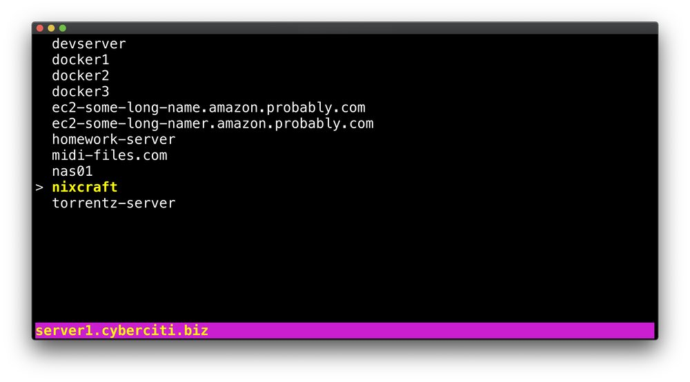
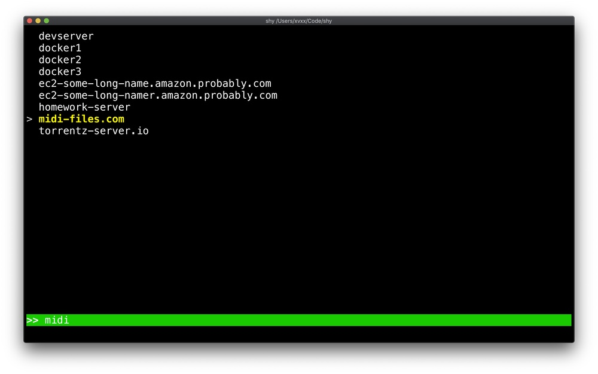
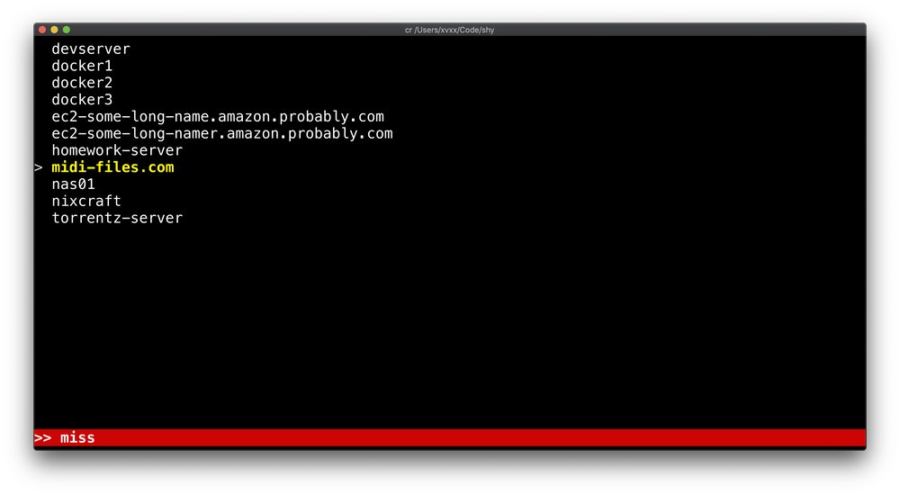
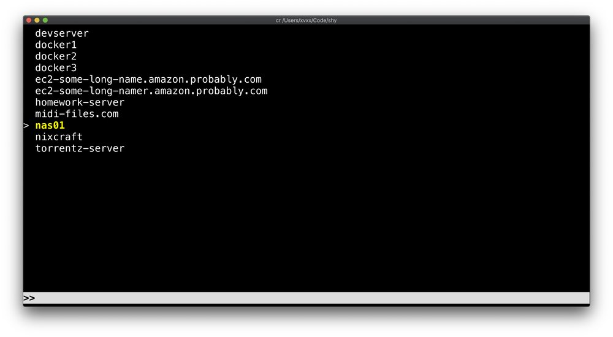

# shy

`shy` is a lil console ui for quickly connecting to an ssh server. It
parses your `~/.ssh/config` file and displays all your "Host" patterns,
allowing you to quickly select one using a fuzzy finder prompt.

## install

On macOS you can install with [Homebrew](https://brew.sh/):

    brew install xvxx/code/shy

On Arch Linux, install shy with your favorite [AUR helper][aur]:

    yay -S shy

Binaries for Linux, Raspberry Pi, and Mac are available at
https://github.com/xvxx/shy/releases:

- [shy-v0.1.10-linux-x86_64.tgz][0]
- [shy-v0.1.10-linux-armv7.tgz (Raspberry Pi)][1]
- [shy-v0.1.10-macos.zip][2]

You can also install directly from crates.io:

    cargo install shy

## usage

    Usage: shy [options]

    Options:
        -c, --config FILE    Use FILE instead of ~/.ssh/config
        -s, --search         Start in Search mode.
        -v, --version        Print shy version and exit.
        -h, --help           Show this message.

## keyboard shortcuts

| **Shortcut**        | **Nav Mode**        | **Search Mode**                    |
| ------------------- | ------------------- | ---------------------------------- |
| `i`, `s`, `f`, `/`  | Enter search mode   |                                    |
| `up`, `ctrl-p`      | Move selection up   | Jump to previous match             |
| `down`, `ctrl-n`    | Move selection down | Jump to next match                 |
| `PageDown`, `space` | Jump down 5 entries |                                    |
| `PageUp`, `-`       | Jump up 5 entries   |                                    |
| `r`, `F5`           | Refresh             |                                    |
| `ctrl-c`, `ESC`     | Quit                | Clear Input, then Exit Search Mode |

## screenies

|  |  |
| --------------------------------- | --------------------------------- |
|  |  |

[cargo]: https://rustup.rs/
[aur]: https://wiki.archlinux.org/index.php/AUR_helpers
[0]: https://github.com/xvxx/shy/releases/download/v0.1.10/shy-v0.1.10-linux-x86_64.tgz
[1]: https://github.com/xvxx/shy/releases/download/v0.1.10/shy-v0.1.10-linux-armv7.tgz
[2]: https://github.com/xvxx/shy/releases/download/v0.1.10/shy-v0.1.10-macos.zip
